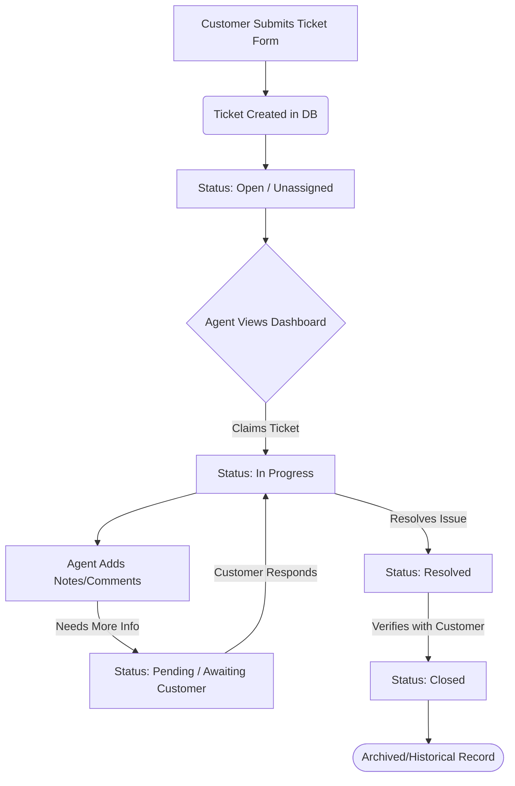
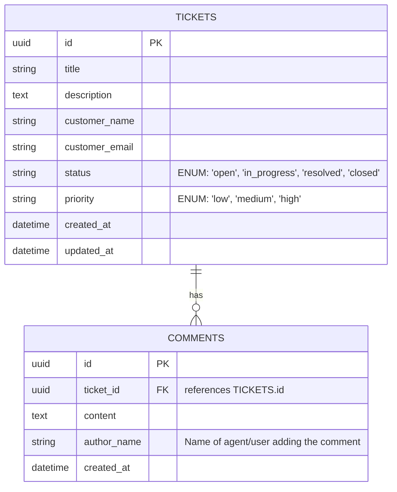

# Hiring Assignment Analysis: Customer Support Ticketing CRM System

Welcome! This document provides a comprehensive, senior-level architectural breakdown of the Customer Support Ticketing CRM assignment. It is designed to be highly accessible for a student developer while explaining the professional-grade reasoning behind every design choice.

---

## 1. What Business Problem This Application Solves

In any business, customers experience issues (e.g., broken features, billing discrepancies, delivery delays). If they email or call support directly without a tracking system:
* **Messages get lost** in cluttered agent inboxes.
* **Lack of collaboration** leads to multiple agents answering the same email or ignoring others.
* **No history tracking** means agents cannot see past interactions with the same customer.
* **No performance measurement** prevents management from knowing how fast issues are resolved.

A **Ticketing CRM (Customer Relationship Management) System** centralizes and tracks every issue from discovery to resolution. It turns unstructured customer messages into structured, trackable, and collaborative database records (tickets), ensuring accountability, faster resolutions, and better customer satisfaction.

---

## 2. What the Company is Actually Testing

While the requirements ask for core features (create, search, filter, update), the hiring team is evaluating your foundational engineering principles:

| Core Skill | What They Are Looking For | How to Show It |
| :--- | :--- | :--- |
| **System Design** | Can you structure a database and API logically? | Clean schema with correct relational constraints, RESTful API endpoint naming. |
| **Code Quality** | Is your code clean, modular, and maintainable? | Organized folder structure, descriptive variable names, DRY (Don't Repeat Yourself) code. |
| **User Experience (UX)** | Do you build apps for real humans? | Adding loading states, disabled buttons during API requests, error messages, and success toasts. |
| **Edge-Case Handling** | Can your code handle unexpected inputs? | Backend schema validation, handling empty search results gracefully, sanitizing inputs. |
| **Delivery & DevOps** | Can you deploy and ship a working product? | A fully functioning deployed URL, plus a comprehensive, professional `README.md`. |

---

## 3. Functional Requirements

These define **what** the system must do:

* **Ticket Submission Form**: A public or internal page to submit new support requests.
* **Agent Dashboard (Ticket List)**: A central dashboard showing all tickets with key details (ID, Title, Customer, Priority, Status, Created Date).
* **Search & Filters**:
  * Free-text search matching ticket titles, descriptions, or customer emails.
  * Dropdown filters to toggle tickets by **Status** (`Open`, `In Progress`, `Resolved`, `Closed`) and **Priority** (`Low`, `Medium`, `High`).
* **Ticket Details View**: A dedicated view showing the complete details of a single ticket.
* **Status Transitions**: A control element (e.g., dropdown) to update the status of a ticket.
* **Activity Log / Comments**: A thread under the ticket details where agents can add notes/comments to document progress.

---

## 4. Non-Functional Requirements

These define **how** the system should perform and behave:

* **Usability & Design**: The interface should be intuitive and clean. Use proper typography, color-coded badges for status/priority, and a responsive layout that works on mobile.
* **Data Integrity**: Deleting a ticket should cascade to its comments, or enforce relations so database orphans aren't created.
* **Validation**:
  * Email inputs must be valid email formats.
  * Ticket titles and descriptions cannot be empty or solely whitespace.
* **Performance**: Keep queries efficient. Use database indexing on high-traffic fields like `status` and `customer_email`.
* **Security**: Sanitize inputs to prevent SQL Injection and Cross-Site Scripting (XSS).

---

## 5. User & Ticket Lifecycle Flow

Here is the standard lifecycle flow of a support ticket from submission to resolution:



---

## 6. Database Entities & Relationships

We will use a relational schema. A single-to-many relationship is required between `tickets` and `comments`.



> [!NOTE]
> For simplicity and high developer velocity in a 2-day assessment, you can use **SQLite** (local file-based) or **Supabase** (Postgres in the cloud). Both support this schema perfectly.

---

## 7. API Design Requirements

Implement a clean RESTful API. Use standard HTTP response codes and structures:

| HTTP Method | Endpoint | Description | Request Body Example | Success Status |
| :--- | :--- | :--- | :--- | :--- |
| **POST** | `/api/tickets` | Create a new ticket | `{ "title": "...", "description": "...", "customer_name": "...", "customer_email": "...", "priority": "medium" }` | `201 Created` |
| **GET** | `/api/tickets` | Fetch tickets with search/filters | *Query parameters: `?search=billing&status=open&priority=high`* | `200 OK` |
| **GET** | `/api/tickets/:id` | Get details of a single ticket (includes comments array) | *None* | `200 OK` |
| **PATCH** | `/api/tickets/:id` | Update ticket details (e.g., status/priority) | `{ "status": "in_progress" }` | `200 OK` |
| **POST** | `/api/tickets/:id/comments` | Add a comment to a ticket | `{ "content": "Checking logs for user account", "author_name": "Agent Sarah" }` | `201 Created` |

### Error Format Example
If validation fails, return a consistent payload:
```json
{
  "error": "Validation Failed",
  "details": [
    "Customer email is invalid",
    "Ticket description is required"
  ]
}
```

---

## 8. Frontend Page Requirements

To stand out, design a modern, visually striking dashboard. Use modern UI principles like dark-mode compatibility, glassmorphism, and color-coded tags.

### 1. Dashboard Page (`/`)
* **Header**: Title, quick stats metrics (e.g., "Total Open: 5", "Pending: 3"), and a "+ New Ticket" button.
* **Control Bar**: Free-text search input and filter dropdowns (Status, Priority).
* **Ticket Table/Grid**: List of tickets. Each row/card should show:
  * Colorful badge representing **Status** (Open = Red/Yellow, In Progress = Blue, Resolved = Green, Closed = Gray).
  * Color-coded badge for **Priority** (High = Red, Medium = Orange, Low = Green).
  * Quick hover effects to indicate interactivity.

### 2. New Ticket Page / Modal (`/new` or Modal)
* A clean form with fields: `Name`, `Email`, `Title`, `Description`, and `Priority`.
* High-quality real-time form validation (disables the submit button if inputs are invalid).

### 3. Ticket Detail Page (`/tickets/:id`)
* **Left Column / Main Card**: Full title, description, customer info, and quick actions (status update buttons).
* **Right Column / Sidebar**: Conversation history (activity timeline).
  * List of comments in chronological order.
  * Form to add a new comment with a submit button.

---

## 9. Minimum Viable Product (MVP) Scope

Focus on delivering these features first to ensure you have a working submission:
1. **Database Schema**: Setup `tickets` and `comments` tables.
2. **API Endpoints**: Submit a ticket, retrieve filtered tickets, update status, and post a comment.
3. **Frontend Dashboard**: View tickets, search/filter them, and open a ticket detail view.
4. **Interactive Actions**: Change status and post comments from the detail view.
5. **Deployment**: Simple deployment of both backend and frontend.

---

## 10. Features to AVOID Prioritizing (Keep as Optional)

Do **not** waste time on these unless the core application is completely finished and fully polished:
* **Complex Multi-role Authentication**: Building sign-up, email confirmations, password reset, and JWT refreshes can consume a full day. Instead, mock an agent's session or put a simple "Acting Agent Name" selector in the header.
* **Real-time WebSockets**: Making tickets update instantly in real-time is cool but highly prone to bugs and deployment issues. Normal polling or manual page refreshing is perfectly acceptable for an MVP.
* **File Attachments**: Uploading images/PDFs requires S3 or Supabase Storage setup. Keep it strictly text-based first.
* **Rich Text Editing**: Avoid embedding complex rich-text libraries (like Quill/Draft.js) which cause form-handling headaches. Use plain `<textarea>` styled nicely.

---

## 11. Common Mistakes Candidates Make

* **No Setup Documentation**: The reviewer runs `npm start` and it crashes because env variables or DB setups are missing. A clear `README.md` is mandatory.
* **No Loading/Error States**: Buttons that stay clickable during API saves, causing double-creation of tickets; pages that freeze without a spinner while fetching data.
* **Poor Folder Structure**: Dumping all code inside `server.js` and `App.js`. Keep a separation of concerns:
  * Backend: controllers, routes, models, database config.
  * Frontend: components, pages, hooks, utils.
* **Skipping Validation**: Assuming the client sends perfect data and letting the server crash on undefined properties.
* **Failing to Deploy**: Sending a GitHub link with "Runs fine on my local machine." If the assignment asks for deployment, configure it early!

---

## 12. Recommended Tech Stack & Architecture for 2-3 Days

To achieve a **premium user experience** and **rapid delivery**, we recommend building a unified application using **Vite + React** for the frontend, **Express + Node.js** for the backend, and **SQLite** for the database. 

### Why this stack?
* **Zero Overhead**: SQLite requires no installation/credentials and runs from a local file, making it perfect for peer review.
* **Highly Standard**: Express and React are the industry defaults, making the codebase instantly readable to any engineer reviewing your work.
* **Tailwind CSS**: Speeds up visual styling tremendously so you can build a stunning UI without writing thousands of lines of CSS.

### Proposed Directory Layout
```text
AIHybridProject/
├── backend/
│   ├── src/
│   │   ├── config/          # DB connection setup
│   │   ├── controllers/     # Route business logic
│   │   ├── routes/          # Express route definitions
│   │   ├── middleware/      # Error handler & input validators
│   │   └── server.js        # Entry point
│   ├── package.json
│   └── database.sqlite      # SQLite database file (ignored in git, created on start)
├── frontend/
│   ├── src/
│   │   ├── components/      # Reusable UI elements (badges, buttons, fields)
│   │   ├── pages/           # Dashboard, TicketDetail, CreateTicket
│   │   ├── services/        # API client calls (Axios/Fetch)
│   │   ├── App.jsx
│   │   └── main.jsx
│   ├── package.json
│   └── tailwind.config.js
└── README.md
```

---
*Proceed to the next phase when you are ready to set up the workspace.*
